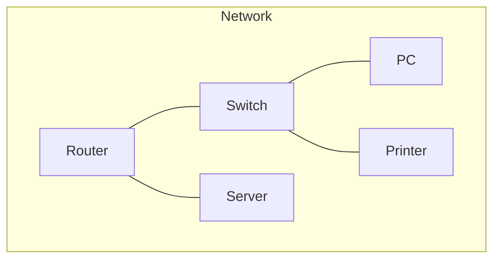
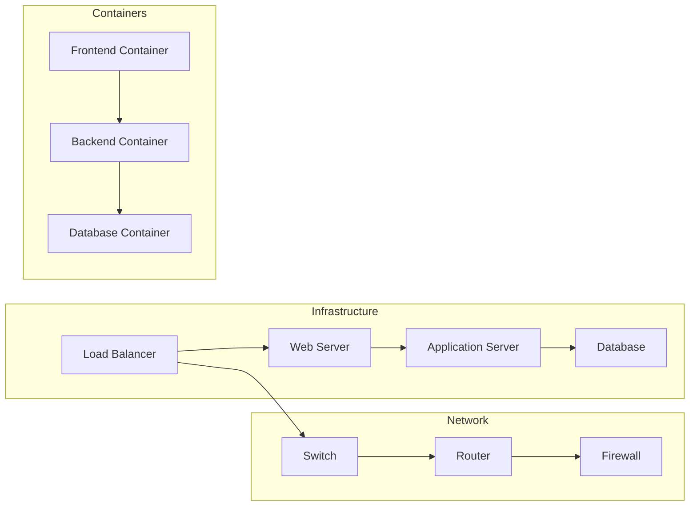
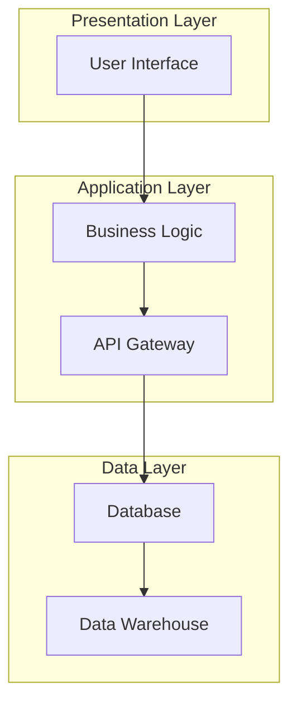

To build network diagrams using as much code as possible, you can use tools like **Mermaid** or **PlantUML**, both of which allow you to describe diagrams using simple text-based syntax.

### Using Mermaid

Mermaid is a great tool for creating diagrams from textual descriptions. It can be easily integrated into many documentation platforms like GitHub, GitLab, and various static site generators.

#### Example Network Diagram with Mermaid



You can render this diagram using any Mermaid-compatible tool or website, such as the Mermaid Live Editor: [Mermaid Live Editor](https://mermaid-js.github.io/mermaid-live-editor/).

### Using PlantUML

PlantUML is another powerful tool for creating diagrams from textual descriptions. It's widely used for UML diagrams but can also be used for network diagrams.

#### Example Network Diagram with PlantUML

```plantuml
@startuml
!define RECTANGLE "rect"
!define CIRCLE "circle"

RECTANGLE Router
RECTANGLE Switch
RECTANGLE PC
RECTANGLE Printer
RECTANGLE Server

Router --> Switch
Switch --> PC
Switch --> Printer
Router --> Server
@enduml
```

You can use various PlantUML tools to render this diagram. One popular option is the PlantUML Online Server: [PlantUML Online Server](http://www.plantuml.com/plantuml/uml).

### Steps to Create and View Diagrams

1. **Write the Code**:
   - Write your diagram code using Mermaid or PlantUML syntax in a text file.

2. **Render the Diagram**:
   - Use an online tool or local renderer to convert the text file into a visual diagram.

3. **Integrate with Documentation**:
   - Embed the code directly into your documentation platform if it supports Mermaid or PlantUML.

### Automation and Scripting

To automate the generation of these diagrams, you can use scripts. Here’s an example of a simple Bash script to generate a PlantUML diagram:

#### Bash Script for PlantUML

```bash
#!/bin/bash

# Define the diagram in PlantUML syntax
cat <<EOF > network_diagram.puml
@startuml
!define RECTANGLE "rect"
!define CIRCLE "circle"

RECTANGLE Router
RECTANGLE Switch
RECTANGLE PC
RECTANGLE Printer
RECTANGLE Server

Router --> Switch
Switch --> PC
Switch --> Printer
Router --> Server
@enduml
EOF

# Use PlantUML to generate the diagram
plantuml network_diagram.puml
```

Make sure you have PlantUML and Java installed on your system to run this script.

### Using Markdown for Documentation

You can also embed Mermaid diagrams directly in Markdown files for your documentation:

#### Markdown with Mermaid

```markdown
# Network Diagram


```

This way, you can keep your diagrams as code within your documentation, making them easy to maintain and update.

These approaches allow you to create and manage diagrams using code, making them reproducible and version-controlled, which is ideal for collaborative and automated environments.

---

Great! For representing containers, networks, and infrastructure with logic and layers of abstraction, we can use both Mermaid and Draw.io to create comprehensive and clear diagrams. Here are some detailed examples and instructions for each tool.

### Mermaid Diagrams

#### Container and Network Diagram



#### Layered Abstraction Diagram



### Draw.io (diagrams.net)

#### Creating the Diagram

1. **Open Draw.io** and create a new diagram.
2. **Choose a template** or start with a blank diagram.
3. **Use the shapes panel** on the left to drag and drop elements to represent different components.

#### Example Steps

1. **Add Shapes for Containers**:
   - Use rectangular shapes to represent containers.
   - Label each shape (e.g., "Frontend Container", "Backend Container").

2. **Add Shapes for Network Components**:
   - Use different shapes for network components like switches, routers, and firewalls.
   - Connect these shapes using lines to represent network connections.

3. **Add Layers of Abstraction**:
   - Group related components together and use container shapes to represent different layers.
   - Label each layer (e.g., "Presentation Layer", "Application Layer", "Data Layer").

4. **Connect Components**:
   - Use arrows to show the flow of data between different components.
   - Use different colors or styles to differentiate between layers and types of connections.

### Example Draw.io Diagram

Here’s a more specific step-by-step guide for creating a layered infrastructure diagram:

1. **Presentation Layer**:
   - Add a rectangle and label it "User Interface".
   - Place it at the top of the diagram.

2. **Application Layer**:
   - Add two rectangles below the presentation layer, labeled "Business Logic" and "API Gateway".
   - Group them together using a larger rectangle labeled "Application Layer".

3. **Data Layer**:
   - Add two rectangles below the application layer, labeled "Database" and "Data Warehouse".
   - Group them together using a larger rectangle labeled "Data Layer".

4. **Connections**:
   - Draw arrows from "User Interface" to "Business Logic".
   - Draw arrows from "Business Logic" to "API Gateway".
   - Draw arrows from "API Gateway" to "Database".
   - Draw arrows from "Database" to "Data Warehouse".

By following these steps, you’ll have a clear and organized diagram representing containers, networks, and infrastructure with layers of abstraction.

### Tips for Effective Diagrams

1. **Consistency**: Keep your shapes and styles consistent to avoid confusion.
2. **Labels**: Clearly label each component and connection.
3. **Colors**: Use colors to differentiate between layers or types of components.
4. **Grouping**: Use grouping to show related components and layers.

Feel free to provide more specific details or ask for additional examples if needed!
