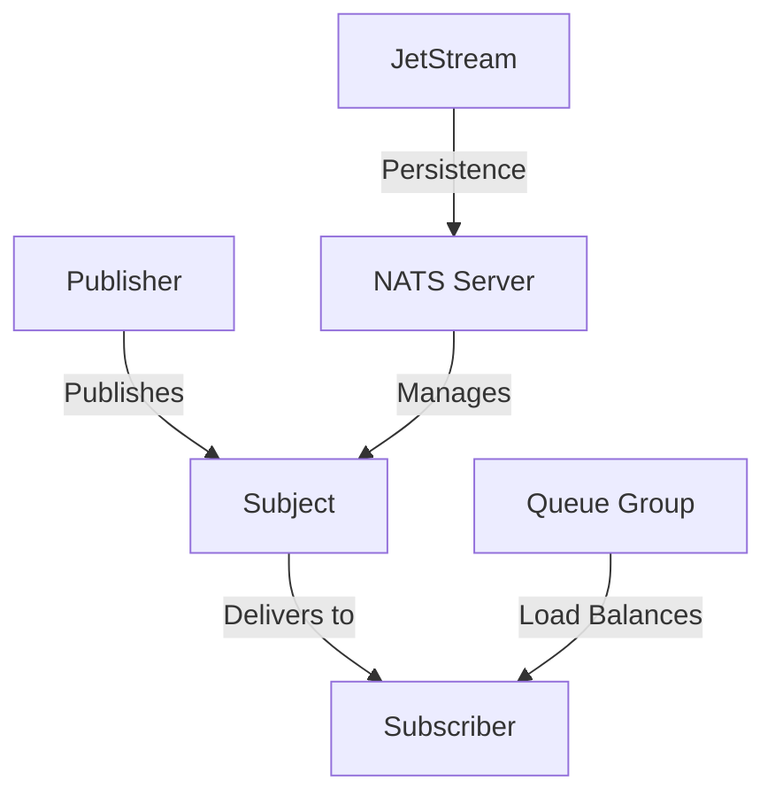
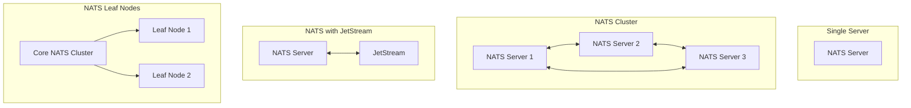
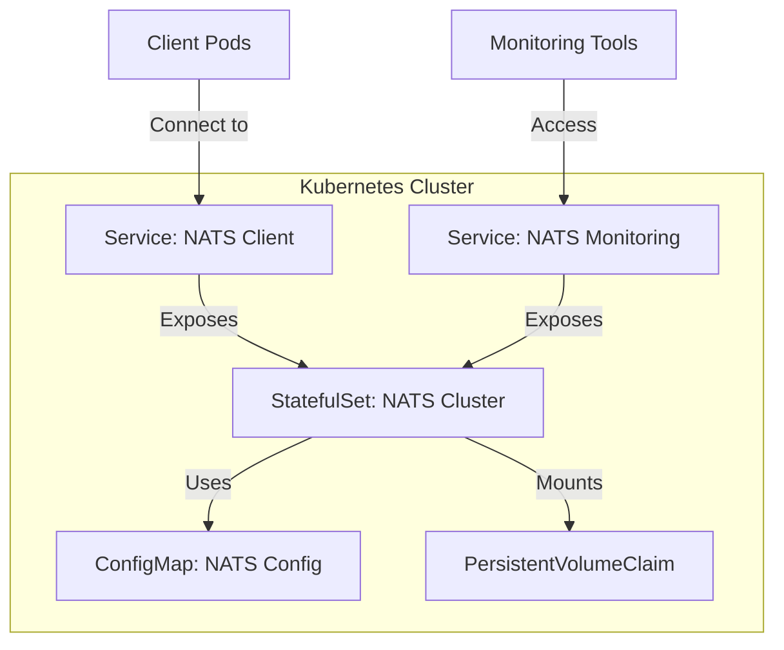
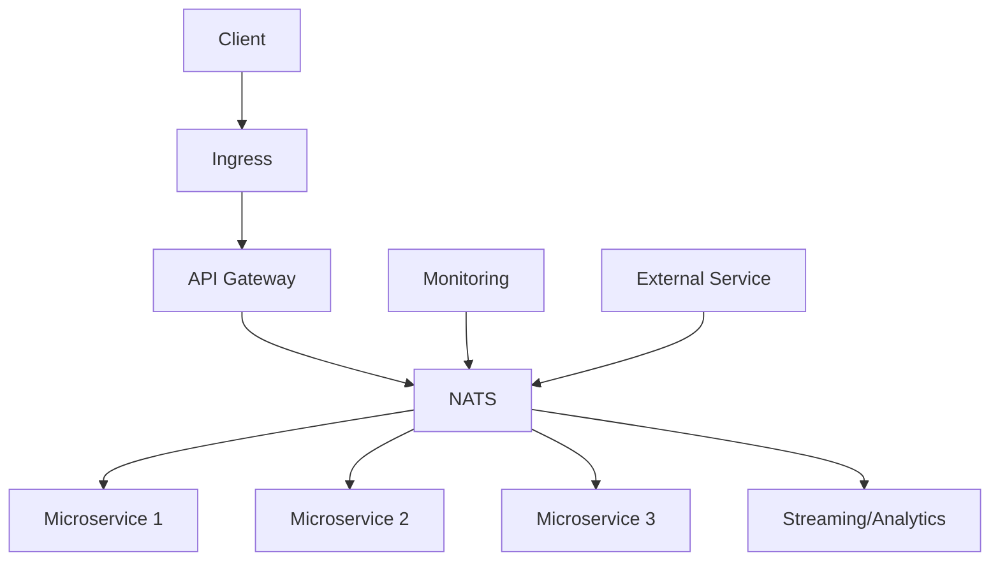

Certainly! Let's approach this from a NATS perspective and explore the most commonly used deployment strategies. We'll use Mermaid diagrams to visualize these concepts where appropriate.

1. NATS Core Concepts

First, let's visualize the core concepts of NATS:




2. Common NATS Deployment Strategies

Now, let's explore the most common NATS deployment strategies:

a) Single NATS Server:
   - Suitable for development and small-scale applications.
   - No built-in fault tolerance or high availability.

b) NATS Cluster:
   - Provides high availability and fault tolerance.
   - Allows for horizontal scaling.

c) NATS with JetStream:
   - Adds persistence and replay capabilities to NATS.
   - Suitable for applications requiring guaranteed message delivery.

d) NATS Leaf Nodes:
   - Allows for creating a hub-and-spoke topology.
   - Useful for edge computing or multi-region deployments.

Let's visualize these strategies:




3. Deploying NATS in Kubernetes

Now, let's look at how these strategies translate to Kubernetes deployments:

a) Single NATS Server:
   - Use a simple Deployment with a single replica.
   - Suitable for development environments (like Minikube).

b) NATS Cluster:
   - Use a StatefulSet for ordered, stable network identities.
   - Typically deployed with 3 or more replicas for high availability.

c) NATS with JetStream:
   - Similar to NATS Cluster, but with additional configuration for JetStream.
   - Requires persistent volumes for storage.

d) NATS Leaf Nodes:
   - Deploy a core NATS cluster.
   - Deploy leaf nodes as separate Deployments or StatefulSets.
   - Configure leaf nodes to connect to the core cluster.

Let's visualize a NATS Cluster deployment in Kubernetes:




4. NATS Deployment Best Practices

When deploying NATS in Kubernetes, consider these best practices:

a) Use StatefulSets for NATS clusters to maintain stable network identities.
b) Implement proper resource requests and limits.
c) Use PodDisruptionBudgets to ensure high availability during cluster operations.
d) Implement proper security measures (TLS, authentication).
e) Set up monitoring and alerting.

Here's an example of a NATS StatefulSet configuration incorporating some of these practices:


```yaml
apiVersion: apps/v1
kind: StatefulSet
metadata:
  name: nats-cluster
spec:
  serviceName: "nats"
  replicas: 3
  selector:
    matchLabels:
      app: nats
  template:
    metadata:
      labels:
        app: nats
    spec:
      containers:
      - name: nats
        image: nats:2.8.4-alpine3.15
        ports:
        - containerPort: 4222
          name: client
        - containerPort: 6222
          name: cluster
        - containerPort: 8222
          name: monitor
        command:
         - "nats-server"
         - "--config"
         - "/etc/nats-config/nats.conf"
        resources:
          requests:
            cpu: "100m"
            memory: "128Mi"
          limits:
            cpu: "500m"
            memory: "512Mi"
        volumeMounts:
        - name: config-volume
          mountPath: /etc/nats-config
        - name: data
          mountPath: /data
      volumes:
      - name: config-volume
        configMap:
          name: nats-config
  volumeClaimTemplates:
  - metadata:
      name: data
    spec:
      accessModes: ["ReadWriteOnce"]
      resources:
        requests:
          storage: 1Gi
---
apiVersion: policy/v1
kind: PodDisruptionBudget
metadata:
  name: nats-pdb
spec:
  maxUnavailable: 1
  selector:
    matchLabels:
      app: nats

```

5. Scaling and Performance Considerations

When deploying NATS, consider these scaling and performance factors:

a) Horizontal Scaling: Add more NATS server instances to handle increased load.
b) Vertical Scaling: Increase resources (CPU, memory) for NATS servers.
c) Client Connections: Monitor and manage the number of client connections per server.
d) Message Size and Rate: Consider the impact of message size and publishing rate on performance.
e) JetStream: When using JetStream, consider storage performance and capacity.

By understanding these deployment strategies and best practices, you can effectively deploy NATS in a Kubernetes environment, whether it's a local Minikube setup or a production cluster. The choice of strategy depends on your specific requirements for scalability, availability, and persistence.

Would you like to dive deeper into any particular aspect of NATS deployment, or shall we proceed with implementing one of these strategies in a Kubernetes environment?

---

NATS (Neural Autonomic Transport System) is a lightweight, high-performance messaging system that's often used in distributed systems and microservices architectures. It's particularly well-suited for cloud-native applications and can be effectively integrated into Kubernetes environments. Let's explore how and where NATS is typically used:

1. Use Cases for NATS:

a) Microservices Communication:
   - NATS serves as a message bus between microservices, enabling decoupled, event-driven architectures.

b) IoT Message Streaming:
   - It's used for handling high-volume data streams from IoT devices.

c) Command and Control Systems:
   - NATS can distribute commands to multiple receivers efficiently.

d) Real-time Data Streaming:
   - It's suitable for applications requiring real-time data processing and distribution.

e) Service Discovery:
   - NATS can be used as a lightweight service discovery mechanism.

f) Load Balancing:
   - It can distribute work across multiple instances of a service.

2. Where NATS Fits in a Kubernetes Architecture:




In this architecture:
- NATS serves as a central message bus for microservices.
- It can be used for service-to-service communication.
- External services can publish or subscribe to NATS topics.
- It can be integrated with monitoring and analytics systems.

3. Implementing NATS in Kubernetes:

To deploy NATS in a Kubernetes cluster, you typically use a StatefulSet for the NATS server and a Service to expose it. Here's a basic example:


```yaml
---
apiVersion: v1
kind: Service
metadata:
  name: nats
  labels:
    app: nats
spec:
  selector:
    app: nats
  ports:
  - name: client
    port: 4222
  - name: cluster
    port: 6222
  - name: monitor
    port: 8222
  clusterIP: None
---
apiVersion: apps/v1
kind: StatefulSet
metadata:
  name: nats
spec:
  serviceName: "nats"
  replicas: 3
  selector:
    matchLabels:
      app: nats
  template:
    metadata:
      labels:
        app: nats
    spec:
      containers:
      - name: nats
        image: nats:2.1.9-alpine3.12
        ports:
        - containerPort: 4222
          name: client
        - containerPort: 6222
          name: cluster
        - containerPort: 8222
          name: monitor
        command:
         - "/nats-server"
         - "--cluster"
         - "nats://0.0.0.0:6222"
         - "--http_port"
         - "8222"
        volumeMounts:
        - name: config-volume
          mountPath: /etc/nats-config
      volumes:
      - name: config-volume
        emptyDir: {}

```

4. Integrating NATS with Existing Services:

To use NATS in your applications, you would typically:

a) Add NATS client libraries to your microservices.
b) Configure services to publish events to NATS topics.
c) Set up subscribers in relevant services to listen for specific events.

Here's a simple Python example using the `nats-py` client:

```python
import asyncio
from nats.aio.client import Client as NATS

async def run():
    nc = NATS()

    await nc.connect("nats://nats-service:4222")

    async def message_handler(msg):
        subject = msg.subject
        data = msg.data.decode()
        print(f"Received a message on '{subject}': {data}")

    await nc.subscribe("foo", cb=message_handler)

    await nc.publish("foo", b'Hello World!')

    await asyncio.sleep(1)

if __name__ == '__main__':
    asyncio.run(run())

```

5. Considerations for Using NATS:

- Scalability: NATS is designed to be highly scalable, making it suitable for large, distributed systems.
- Performance: It offers low-latency messaging, which is crucial for real-time applications.
- Simplicity: NATS has a simple pub-sub model, making it easy to integrate and use.
- Security: Ensure proper authentication and authorization are set up, especially in production environments.
- Monitoring: Use NATS monitoring endpoints to keep track of system health and performance.

6. NATS vs. Other Messaging Systems:

- Compared to Kafka: NATS is lighter and simpler, while Kafka offers more robust persistence and streaming capabilities.
- Compared to RabbitMQ: NATS is generally faster but offers fewer routing options.

In a Minikube environment, you can use NATS to simulate a production-like microservices architecture, allowing you to develop and test event-driven systems locally before deploying to a full-scale Kubernetes cluster.

---

## NATS in Kubernetes Architecture


## NATS Kubernetes Configuration

```yml
---
apiVersion: v1
kind: Service
metadata:
  name: nats
  labels:
    app: nats
spec:
  selector:
    app: nats
  ports:
  - name: client
    port: 4222
  - name: cluster
    port: 6222
  - name: monitor
    port: 8222
  clusterIP: None
---
apiVersion: apps/v1
kind: StatefulSet
metadata:
  name: nats
spec:
  serviceName: "nats"
  replicas: 3
  selector:
    matchLabels:
      app: nats
  template:
    metadata:
      labels:
        app: nats
    spec:
      containers:
      - name: nats
        image: nats:2.1.9-alpine3.12
        ports:
        - containerPort: 4222
          name: client
        - containerPort: 6222
          name: cluster
        - containerPort: 8222
          name: monitor
        command:
         - "/nats-server"
         - "--cluster"
         - "nats://0.0.0.0:6222"
         - "--http_port"
         - "8222"
        volumeMounts:
        - name: config-volume
          mountPath: /etc/nats-config
      volumes:
      - name: config-volume
        emptyDir: {}
```

## NATS Python Client Example

```python
import asyncio
from nats.aio.client import Client as NATS

async def run():
    nc = NATS()

    await nc.connect("nats://nats-service:4222")

    async def message_handler(msg):
        subject = msg.subject
        data = msg.data.decode()
        print(f"Received a message on '{subject}': {data}")

    await nc.subscribe("foo", cb=message_handler)

    await nc.publish("foo", b'Hello World!')

    await asyncio.sleep(1)

if __name__ == '__main__':
    asyncio.run(run())
```
---
