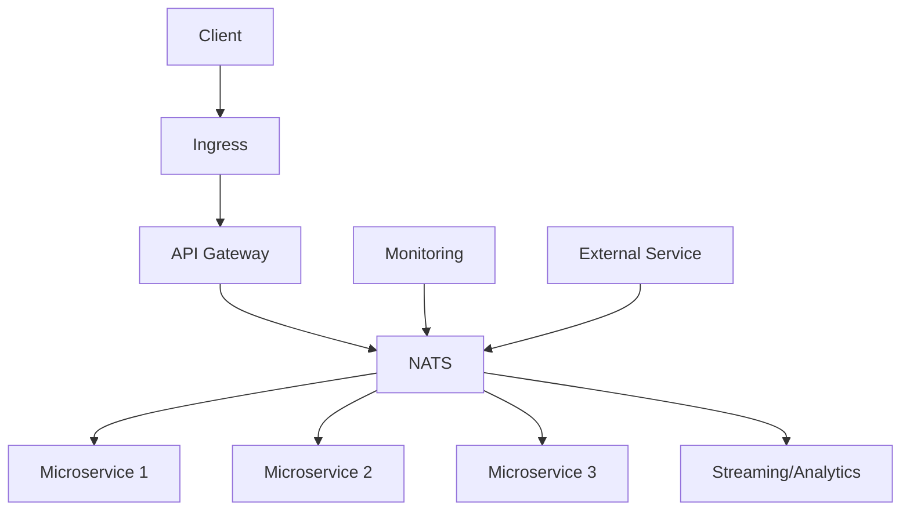

NATS (Neural Autonomic Transport System) is a lightweight, high-performance messaging system that's often used in distributed systems and microservices architectures. It's particularly well-suited for cloud-native applications and can be effectively integrated into Kubernetes environments. Let's explore how and where NATS is typically used:

1. Use Cases for NATS:

a) Microservices Communication:
   - NATS serves as a message bus between microservices, enabling decoupled, event-driven architectures.

b) IoT Message Streaming:
   - It's used for handling high-volume data streams from IoT devices.

c) Command and Control Systems:
   - NATS can distribute commands to multiple receivers efficiently.

d) Real-time Data Streaming:
   - It's suitable for applications requiring real-time data processing and distribution.

e) Service Discovery:
   - NATS can be used as a lightweight service discovery mechanism.

f) Load Balancing:
   - It can distribute work across multiple instances of a service.

2. Where NATS Fits in a Kubernetes Architecture:




In this architecture:
- NATS serves as a central message bus for microservices.
- It can be used for service-to-service communication.
- External services can publish or subscribe to NATS topics.
- It can be integrated with monitoring and analytics systems.

3. Implementing NATS in Kubernetes:

To deploy NATS in a Kubernetes cluster, you typically use a StatefulSet for the NATS server and a Service to expose it. Here's a basic example:


```yaml
---
apiVersion: v1
kind: Service
metadata:
  name: nats
  labels:
    app: nats
spec:
  selector:
    app: nats
  ports:
  - name: client
    port: 4222
  - name: cluster
    port: 6222
  - name: monitor
    port: 8222
  clusterIP: None
---
apiVersion: apps/v1
kind: StatefulSet
metadata:
  name: nats
spec:
  serviceName: "nats"
  replicas: 3
  selector:
    matchLabels:
      app: nats
  template:
    metadata:
      labels:
        app: nats
    spec:
      containers:
      - name: nats
        image: nats:2.1.9-alpine3.12
        ports:
        - containerPort: 4222
          name: client
        - containerPort: 6222
          name: cluster
        - containerPort: 8222
          name: monitor
        command:
         - "/nats-server"
         - "--cluster"
         - "nats://0.0.0.0:6222"
         - "--http_port"
         - "8222"
        volumeMounts:
        - name: config-volume
          mountPath: /etc/nats-config
      volumes:
      - name: config-volume
        emptyDir: {}

```

4. Integrating NATS with Existing Services:

To use NATS in your applications, you would typically:

a) Add NATS client libraries to your microservices.
b) Configure services to publish events to NATS topics.
c) Set up subscribers in relevant services to listen for specific events.

Here's a simple Python example using the `nats-py` client:

```python
import asyncio
from nats.aio.client import Client as NATS

async def run():
    nc = NATS()

    await nc.connect("nats://nats-service:4222")

    async def message_handler(msg):
        subject = msg.subject
        data = msg.data.decode()
        print(f"Received a message on '{subject}': {data}")

    await nc.subscribe("foo", cb=message_handler)

    await nc.publish("foo", b'Hello World!')

    await asyncio.sleep(1)

if __name__ == '__main__':
    asyncio.run(run())

```

5. Considerations for Using NATS:

- Scalability: NATS is designed to be highly scalable, making it suitable for large, distributed systems.
- Performance: It offers low-latency messaging, which is crucial for real-time applications.
- Simplicity: NATS has a simple pub-sub model, making it easy to integrate and use.
- Security: Ensure proper authentication and authorization are set up, especially in production environments.
- Monitoring: Use NATS monitoring endpoints to keep track of system health and performance.

6. NATS vs. Other Messaging Systems:

- Compared to Kafka: NATS is lighter and simpler, while Kafka offers more robust persistence and streaming capabilities.
- Compared to RabbitMQ: NATS is generally faster but offers fewer routing options.

In a Minikube environment, you can use NATS to simulate a production-like microservices architecture, allowing you to develop and test event-driven systems locally before deploying to a full-scale Kubernetes cluster.

---

## NATS in Kubernetes Architecture


## NATS Kubernetes Configuration

```yml
---
apiVersion: v1
kind: Service
metadata:
  name: nats
  labels:
    app: nats
spec:
  selector:
    app: nats
  ports:
  - name: client
    port: 4222
  - name: cluster
    port: 6222
  - name: monitor
    port: 8222
  clusterIP: None
---
apiVersion: apps/v1
kind: StatefulSet
metadata:
  name: nats
spec:
  serviceName: "nats"
  replicas: 3
  selector:
    matchLabels:
      app: nats
  template:
    metadata:
      labels:
        app: nats
    spec:
      containers:
      - name: nats
        image: nats:2.1.9-alpine3.12
        ports:
        - containerPort: 4222
          name: client
        - containerPort: 6222
          name: cluster
        - containerPort: 8222
          name: monitor
        command:
         - "/nats-server"
         - "--cluster"
         - "nats://0.0.0.0:6222"
         - "--http_port"
         - "8222"
        volumeMounts:
        - name: config-volume
          mountPath: /etc/nats-config
      volumes:
      - name: config-volume
        emptyDir: {}
```

## NATS Python Client Example

```python
import asyncio
from nats.aio.client import Client as NATS

async def run():
    nc = NATS()

    await nc.connect("nats://nats-service:4222")

    async def message_handler(msg):
        subject = msg.subject
        data = msg.data.decode()
        print(f"Received a message on '{subject}': {data}")

    await nc.subscribe("foo", cb=message_handler)

    await nc.publish("foo", b'Hello World!')

    await asyncio.sleep(1)

if __name__ == '__main__':
    asyncio.run(run())
```
---
